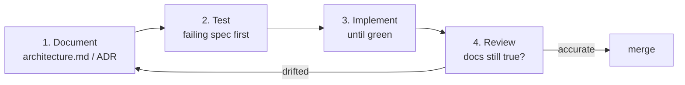

# Working on ChessEdu

The cycle is **document, then test, then implement**. In that order, every time.

## The loop



### 1. Document first

Before writing code, write down what it will do and why:

- A **behaviour change** updates [`docs/architecture.md`](docs/architecture.md) — the diagrams
  and the data model are part of the contract, not decoration.
- A **decision with a real alternative** gets an ADR in [`docs/adr/`](docs/adr/). Copy
  `0000-template.md`. Record what was rejected and why; that is the part worth having later.
- A **behaviour with an external constraint** (a rate limit, a missing OAuth, a licence) gets
  a runbook page like [`docs/chess-com-linking.md`](docs/chess-com-linking.md).

If the doc change is hard to write, the design is not ready. That is the point of doing it
first.

### 2. Test first

Write the failing test before the implementation.

- **Domain rules go in `packages/chess`** and are unit tested there. If you find yourself
  deciding what a blunder is inside a React component or the worker loop, it belongs in
  `packages/chess` instead — that package is I/O-free precisely so the rules stay testable.
- **Database and queue behaviour** is tested against real Postgres (`npm run test:db`), never a
  mock. `SKIP LOCKED` semantics cannot be faked.

  Name such a file `*.db.test.ts`. That suffix puts it in the `db` project, which runs one file
  at a time against the single shared database. These suites reset the tables they own, and
  running two at once let one truncate `user` while another was inserting rows referencing it —
  a failure that appeared or vanished depending on interleaving. Without `TEST_DATABASE_URL`
  the project skips entirely, so the everyday loop stays dependency-free.
- **Server actions** are tested by calling them directly with a stubbed session.
- **One Playwright smoke test** covers sign-in through to the dashboard. Keep it thin;
  everything else belongs a layer down.

A bug fix starts with a test that reproduces the bug and fails.

### 3. Implement

Make it green. Then look at it again.

### 4. Review the docs

Before opening the PR, re-read the doc you changed in step 1. If the implementation taught you
something, the doc is now wrong — fix it in the same PR. Documentation drift is the failure
mode this cycle exists to prevent.

## Commands

```bash
npm install              # once, from the repo root

npm run dev              # web on :3000
npm run dev:worker       # ingest + analysis worker

npm test                 # vitest, watch
npm run test:run         # vitest, single pass (what CI runs)
npm run test:unit        # the pure suites only — no database needed
npm run test:db          # the Postgres-backed suites; needs TEST_DATABASE_URL
npm run typecheck
npm run lint

npm run db:generate      # generate SQL after editing packages/db/src/schema.ts
npm run db:migrate       # apply migrations
npm run db:studio        # browse the database
```

## Conventions

- **TypeScript strict**, including `noUncheckedIndexedAccess`. No `any` without a comment
  saying why.
- **`packages/db` is the single schema owner.** Nothing else writes DDL, and nothing else
  defines a table type.
- **Server actions re-derive the user from the session.** Never accept a `userId` from the
  client — see the security posture in `docs/architecture.md`.
- **The engine evaluates; the LLM explains.** Never ask the model for an evaluation, a best
  move, or an accuracy number. Pass it Stockfish output as fact. This is the rule most likely
  to be broken by accident, and it is the one that makes the coaching trustworthy.
- **Chess.com requests are serial**, conditional, and carry a descriptive `User-Agent`.

## Definition of done

- [ ] The doc that describes this behaviour is accurate.
- [ ] There is a test that fails without the change.
- [ ] `npm run test:run`, `npm run typecheck`, `npm run lint` are green.
- [ ] No secret, key, or personal game data is committed.
