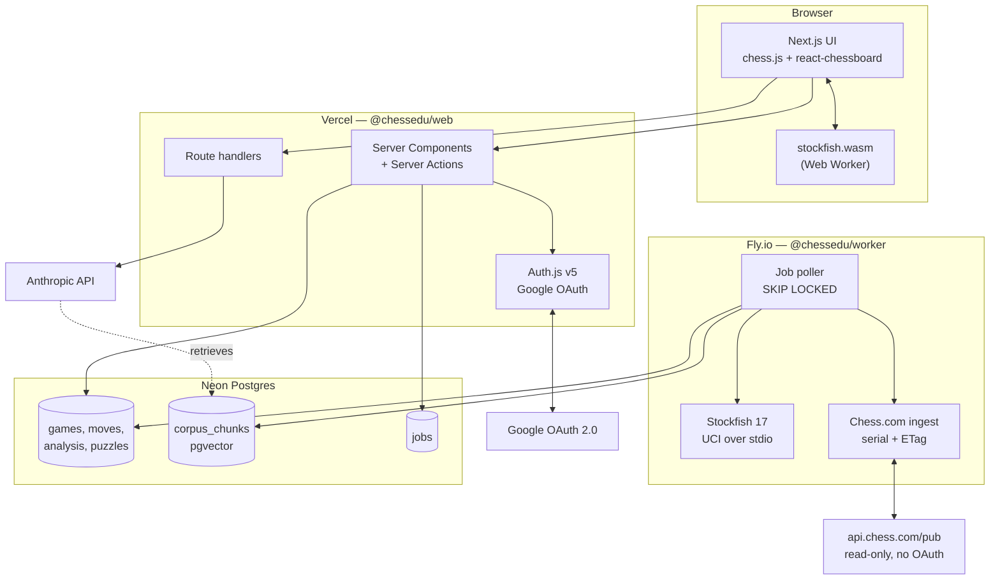
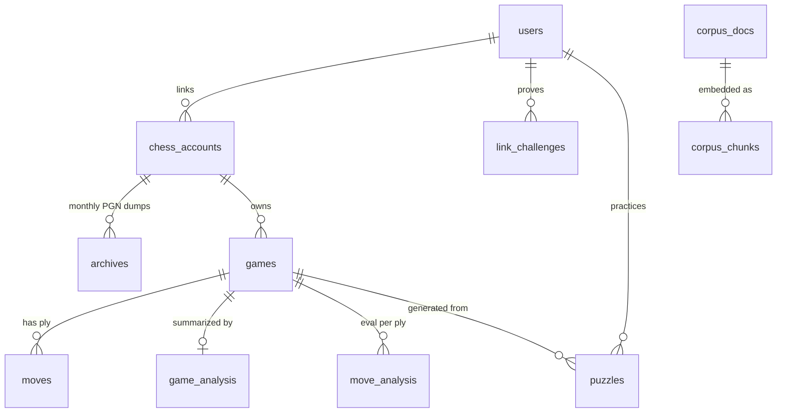
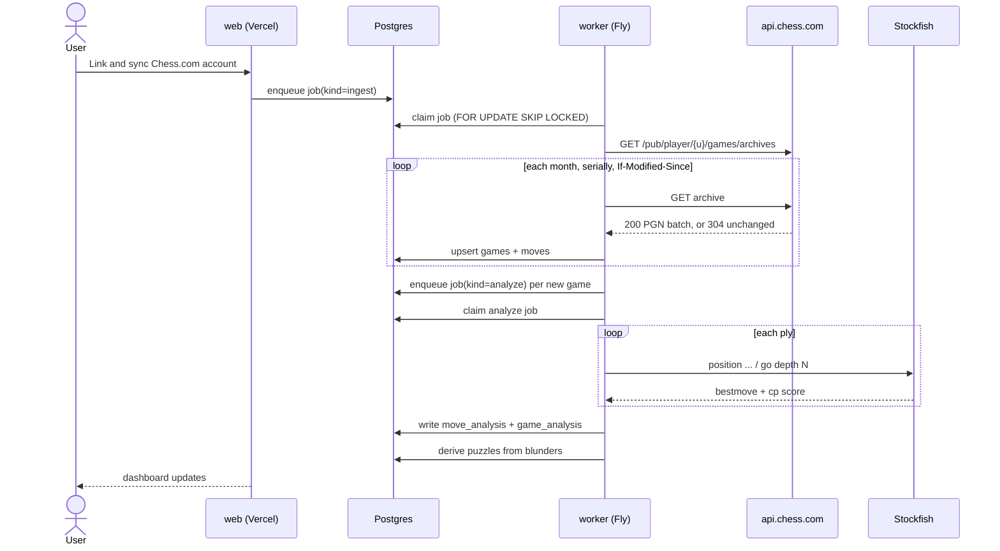
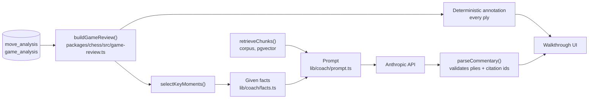

# ChessEdu — Architecture

> Source of truth for how the system is put together. Change this **before** changing code
> (see [CONTRIBUTING.md](../CONTRIBUTING.md)).

## 1. What this is

A personal chess trainer built on my own Chess.com history. Ingest the games, analyze them
with a real engine, and wrap the analysis in an education system: coaching, repertoire,
puzzles from my own blunders, reference literature, and bots to play.

Deployed as a **live website** with Google sign-in and a verified Chess.com account link.

## 2. Stack

| Layer | Choice | Why |
|---|---|---|
| Web app | Next.js 15 (App Router) + React 19 + TypeScript | One codebase for UI, server actions and API routes; first-class Vercel deploy |
| Styling | Tailwind CSS v4 | No config file, fast, consistent |
| Auth | Auth.js v5 (NextAuth), Google provider, DB sessions | Standard and audited; DB sessions give server-side revocation |
| Database | Postgres (Neon) + `pgvector` | Relational core *and* the RAG store in one datastore |
| ORM | Drizzle | Typed schema-as-code, real SQL escape hatch, good migrations |
| Job queue | Postgres `SELECT ... FOR UPDATE SKIP LOCKED` | Deep analysis is minutes long and cannot run in a serverless request. No Redis to operate |
| Analysis worker | Long-running Node service on Fly.io driving Stockfish over UCI | Needs a persistent process, CPU, and a real filesystem for NNUE weights |
| Browser engine | `stockfish.wasm` in a Web Worker | Instant hints and play without burning server CPU |
| Board UI | `chess.js` + `react-chessboard` | De-facto standard pair, well maintained |
| Coaching LLM | Anthropic API (`claude-opus-5`), server-side | It explains; it never evaluates — see section 6 |
| Tests | Vitest, plus Playwright for one smoke E2E | Fast unit/integration loop, thin browser layer |
| CI/CD | GitHub Actions to Vercel (web) and Fly.io (worker) | See [ci-cd.md](./ci-cd.md) |

**Rejected:** a desktop app (the idea note left this open — the website wins because the game
history lives in the cloud anyway and there is nothing to install); Redis/BullMQ (a second
datastore to operate for a queue Postgres already handles at this scale); running Stockfish
inside serverless functions (execution time caps make full-history analysis impossible).

## 3. System shape



## 4. Repository layout

```
chessedu/
├── apps/
│   ├── web/          Next.js site: UI, auth, server actions, API routes
│   └── worker/       Long-running Node service: ingest + Stockfish analysis
├── packages/
│   ├── db/           Drizzle schema, migrations, client, job queue. The single schema owner.
│   ├── chess/        Pure domain logic: PGN parse, phase split, move classification,
│   │                 accuracy math, link-nonce rules. No I/O, so trivially testable.
│   └── chesscom/     The Chess.com API client. Shared, because the web app reads profiles to
│                     verify a link and the worker reads archives to ingest games.
├── docs/             Architecture, ADRs, runbooks.
└── .github/workflows CI + CD
```

`packages/chess` is deliberately **I/O-free**. Every rule that decides *what counts as a
blunder*, *when the endgame starts*, or *whether a link is verified* lives there behind a unit
test, not inside a React component or a worker loop.

It ships TypeScript source rather than a build, so an import is a bundling decision. The
barrel (`@chessedu/chess`) reaches `link.ts`, which needs `node:crypto` and therefore cannot be
bundled for the browser. **Client components import a subpath instead** —
`@chessedu/chess/game-review` is the browser-safe entry the walkthrough UI uses. Adding a new
browser-facing module means adding a matching entry to that package's `exports`.

## 5. Data model



The ownership chain is always `users -> chess_accounts -> games -> ...`. Every query the web
app makes is scoped by `userId` at the top of that chain; there is no row a user can reach
that is not reachable through their own `users.id`.

## 6. The coaching boundary

**The engine evaluates. The LLM explains.** This is a hard architectural rule carried over
from the idea note, and it is enforced structurally rather than by prompt discipline alone:

- Every number a coaching response cites — centipawn loss, best move, accuracy, phase
  strength — is read from `move_analysis` / `game_analysis`, computed by Stockfish, and passed
  to the model as *given facts* in the prompt.
- The model is never asked "was this a blunder?". It is asked "here is the blunder and the
  engine line; explain the idea the player missed."
- Reference-literature citations come from `corpus_chunks` retrieved via pgvector, so a claim
  about theory is attributable to a real source rather than recalled.

## 7. Analysis pipeline



Ingest is **serial and conditional**: Chess.com rate-limits parallel requests and supports
`If-Modified-Since`, so re-syncing an unchanged month costs a single 304. See
[chess-com-linking.md](./chess-com-linking.md).

## 8. The review coach

The dashboard lists games; the review coach is how you *study* one. `/games/{id}/review` walks
a game ply by ply — board, evaluation, and an annotation for **every** move — and adds prose
explanation on the handful of moves that actually decided it.

### Two layers of annotation



**Layer one is deterministic and always present.** `buildGameReview` in `packages/chess` turns
the stored moves and `move_analysis` rows into a `GameReview`: per-ply classification, the
evaluation before and after, the engine's best move and principal variation rendered in SAN,
the phase, and a one-line factual annotation ("Blunder. Eval +0.4 to -3.1, 28% of the win
chance. Engine: 21...Rfe8."). It is a pure function of engine output, so the walkthrough is
complete and correct with the LLM switched off, the API key absent, or the model failing.

**Layer two is prose, and only on key moments.** `selectKeyMoments` ranks plies by win
percentage given up, weighting critical swings and the coached player's own moves above the
opponent's, and returns at most six. Those — never the whole game — are what the model is
asked to explain. Anything the model returns for a ply outside that set is discarded.

### The coaching boundary, mechanically

Section 6 states the rule; this is where it is enforced. `momentFacts()` builds a fixed block
of *given facts* per moment straight out of `move_analysis`, and the prompt hands the model
those numbers and asks only for the idea behind them. The model is never sent a position
without its evaluation, and never asked which move was better. `parseCommentary()` then drops
any citation id the model did not receive, so a fabricated source cannot reach the page.

### Corpus retrieval — a provisional interface

Citations come from `corpus_chunks`. The coach does **not** own the corpus, the embeddings, or
the pgvector query: it depends on a single injected function.

```ts
type RetrieveChunks = (query: string, options?: RetrieveOptions) => Promise<CorpusChunk[]>;
```

`apps/web/lib/coach/retrieval.ts` is the only file that knows this shape; everything downstream
consumes the `Citation` it maps chunks to. The default binding is `noCorpus`, which returns
nothing, so the coach ships and runs uncited until the real retriever lands. **The signature in
that file is provisional** — it is a placeholder for the corpus retrieval contract, and when
that contract is settled it is documented here and `retrieval.ts` is adapted to it. Nothing
else in the coach changes.

### Degradation

Commentary is requested from the page by an explicit action, not on render, because it costs a
model call. Every failure mode — no API key, model error, unparseable response, an unanalysed
game — leaves the deterministic walkthrough intact and reports the shortfall inline. Nothing
about the review is cached in Postgres yet; if the cost of re-explaining the same game becomes
real, a `move_commentary` table is the obvious next step.

## 9. Security posture

- **Sessions** are database-backed, in `httpOnly` + `Secure` + `SameSite=Lax` cookies. No JWT
  in local storage; a session can be revoked server-side.
- **Google OAuth is the only credential path.** No passwords are stored, ever.
- **Authorization is enforced in server code**, never by hiding UI. Every server action
  re-derives `userId` from the session and scopes its query by it.
- **The Chess.com link proves ownership** before any data is attributed to a user. A username
  alone is a public string and proves nothing — see the nonce flow in
  [chess-com-linking.md](./chess-com-linking.md).
- **Secrets** live in Vercel/Fly environment config and `.env.local`. `.env` is gitignored and
  `.env.example` carries only names. The Anthropic key is server-only and never reaches the
  browser.
- **The worker exposes no inbound port.** It polls Postgres; nothing can call it.

## 10. Open questions carried from the idea note

- Lichess as a second ingest source. The `platform` column exists for it; nothing else does.
- Reference-literature licensing. Bootstrap on public-domain classics only.
- Maia/Lc0 bot hosting is heavier than Stockfish — likely a separate Fly machine running a
  CPU Lc0 build with small nets. Not scaffolded yet.
