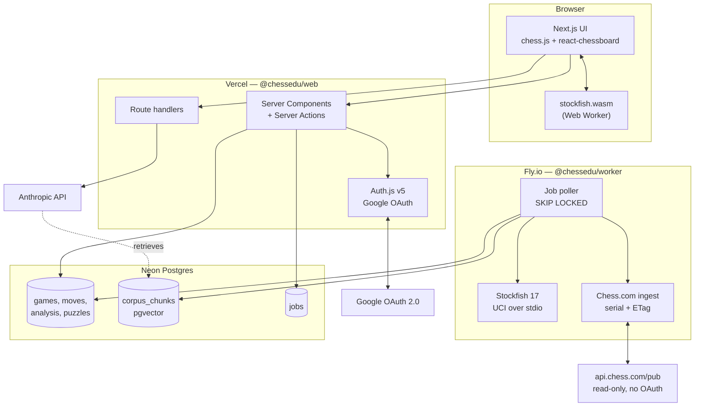
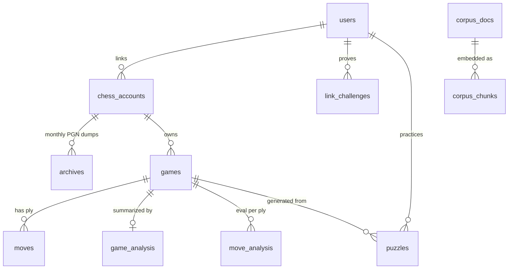
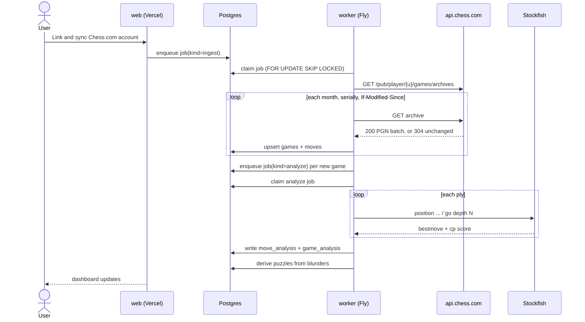
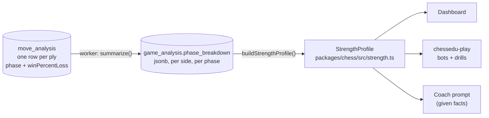

# ChessEdu — Architecture

> Source of truth for how the system is put together. Change this **before** changing code
> (see [CONTRIBUTING.md](../CONTRIBUTING.md)).

## 1. What this is

A personal chess trainer built on my own Chess.com history. Ingest the games, analyze them
with a real engine, and wrap the analysis in an education system: coaching, repertoire,
puzzles from my own blunders, reference literature, and bots to play.

Deployed as a **live website** with Google sign-in and a verified Chess.com account link.

## 2. Stack

| Layer | Choice | Why |
|---|---|---|
| Web app | Next.js 15 (App Router) + React 19 + TypeScript | One codebase for UI, server actions and API routes; first-class Vercel deploy |
| Styling | Tailwind CSS v4 | No config file, fast, consistent |
| Auth | Auth.js v5 (NextAuth), Google provider, DB sessions | Standard and audited; DB sessions give server-side revocation |
| Database | Postgres (Neon) + `pgvector` | Relational core *and* the RAG store in one datastore |
| ORM | Drizzle | Typed schema-as-code, real SQL escape hatch, good migrations |
| Job queue | Postgres `SELECT ... FOR UPDATE SKIP LOCKED` | Deep analysis is minutes long and cannot run in a serverless request. No Redis to operate |
| Analysis worker | Long-running Node service on Fly.io driving Stockfish over UCI | Needs a persistent process, CPU, and a real filesystem for NNUE weights |
| Browser engine | `stockfish.wasm` in a Web Worker | Instant hints and play without burning server CPU |
| Board UI | `chess.js` + `react-chessboard` | De-facto standard pair, well maintained |
| Coaching LLM | Anthropic API (`claude-opus-5`), server-side | It explains; it never evaluates — see section 6 |
| Tests | Vitest, plus Playwright for one smoke E2E | Fast unit/integration loop, thin browser layer |
| CI/CD | GitHub Actions to Vercel (web) and Fly.io (worker) | See [ci-cd.md](./ci-cd.md) |

**Rejected:** a desktop app (the idea note left this open — the website wins because the game
history lives in the cloud anyway and there is nothing to install); Redis/BullMQ (a second
datastore to operate for a queue Postgres already handles at this scale); running Stockfish
inside serverless functions (execution time caps make full-history analysis impossible).

## 3. System shape



## 4. Repository layout

```
chessedu/
├── apps/
│   ├── web/          Next.js site: UI, auth, server actions, API routes
│   └── worker/       Long-running Node service: ingest + Stockfish analysis
├── packages/
│   ├── db/           Drizzle schema, migrations, client, job queue. The single schema owner.
│   ├── chess/        Pure domain logic: PGN parse, phase split, move classification,
│   │                 accuracy math, link-nonce rules. No I/O, so trivially testable.
│   └── chesscom/     The Chess.com API client. Shared, because the web app reads profiles to
│                     verify a link and the worker reads archives to ingest games.
├── docs/             Architecture, ADRs, runbooks.
└── .github/workflows CI + CD
```

`packages/chess` is deliberately **I/O-free**. Every rule that decides *what counts as a
blunder*, *when the endgame starts*, or *whether a link is verified* lives there behind a unit
test, not inside a React component or a worker loop.

## 5. Data model



The ownership chain is always `users -> chess_accounts -> games -> ...`. Every query the web
app makes is scoped by `userId` at the top of that chain; there is no row a user can reach
that is not reachable through their own `users.id`.

## 6. The coaching boundary

**The engine evaluates. The LLM explains.** This is a hard architectural rule carried over
from the idea note, and it is enforced structurally rather than by prompt discipline alone:

- Every number a coaching response cites — centipawn loss, best move, accuracy, phase
  strength — is read from `move_analysis` / `game_analysis`, computed by Stockfish, and passed
  to the model as *given facts* in the prompt.
- The model is never asked "was this a blunder?". It is asked "here is the blunder and the
  engine line; explain the idea the player missed."
- Reference-literature citations come from `corpus_chunks` retrieved via pgvector, so a claim
  about theory is attributable to a real source rather than recalled.

## 7. Analysis pipeline



Ingest is **serial and conditional**: Chess.com rate-limits parallel requests and supports
`If-Modified-Since`, so re-syncing an unchanged month costs a single 304. See
[chess-com-linking.md](./chess-com-linking.md).

## 8. The per-phase strength model

One rating hides where a player is actually losing games. The strength model keeps the three
phases apart, because the coaching, the puzzle mix and the practice opponents all want a
different answer for the opening than for the endgame.

**Every number in it is engine output or a pure function of engine output.** No model reads,
writes, ranks or rounds any of it — see the coaching boundary in section 6. The LLM is handed
the finished profile as fact when it explains what to work on.

### Where the numbers come from



The worker aggregates each analysed game once, into `game_analysis.phase_breakdown`. Readers
never touch `move_analysis` to build a profile: a profile over 500 games is 500 rows, not
40 000 plies.

### The persisted per-game shape

`game_analysis.phase_breakdown` is jsonb holding a `GamePhaseBreakdown`:

```ts
type Phase = 'opening' | 'middlegame' | 'endgame';

interface PhaseSample {
  moves: number;                   // plies this side played in the phase
  accuracy: number | null;         // 0..100, harmonic mean; null when moves === 0
  averageCentipawnLoss: number;    // integer, 0 when moves === 0
  blunders: number;                // moves classified 'blunder'
}

type PhaseBreakdown = Record<Phase, PhaseSample>;      // all three keys always present
interface GamePhaseBreakdown { white: PhaseBreakdown; black: PhaseBreakdown }
```

Both sides are stored, not just the user's: the same game may later be read from the
opponent's side, and re-deriving it would mean re-running the engine.

### The aggregated shape

`buildStrengthProfile(breakdowns)` folds one `PhaseBreakdown` per game — the user's side of
each — into the profile that the rest of the system consumes:

```ts
interface PhaseStrength extends PhaseSample {
  phase: Phase;
  games: number;                   // games that reached this phase at all
  blundersPerHundredMoves: number;
  /** Accuracy points behind this player's own best rated phase. 0 for that phase. */
  deficit: number | null;
  /** False until MIN_MOVES_PER_PHASE plies have accumulated; the numbers are noise below it. */
  rated: boolean;
}

interface StrengthProfile {
  games: number;                   // games folded in
  moves: number;                   // plies across all phases
  phases: Record<Phase, PhaseStrength>;
  focus: Phase | null;             // weakest rated phase; null when nothing is rated yet
  strongest: Phase | null;
}
```

Three rules make this safe to consume:

- **Accuracy recombines exactly.** Per-game accuracy is a harmonic mean, so the mean over
  several games is `Σmoves / Σ(moves / accuracy)` — the same number a single pass over every
  ply would produce, not an average of averages. Centipawn loss is move-weighted and therefore
  carries each game's rounding; treat it as the secondary axis, not the headline.
- **`rated` is the gate.** `MIN_MOVES_PER_PHASE` (150 plies) is the point below which a phase
  is not reported as a strength or a weakness. `focus`, `strongest` and `deficit` only ever
  consider rated phases, and every field is `null`-safe for a player who has just signed up.
- **There is no invented rating.** The strength number *is* accuracy, on the Lichess curve
  already used per move (`packages/chess/src/classify.ts`). Nothing rescales it into a
  fictional Elo.

### Consuming it: practice weights

`practiceWeights(profile)` turns the profile into a distribution over the phases that sums to
1, in proportion to the accuracy each phase is still giving away (`100 - accuracy`). A phase
that is not rated yet is given the mean weight of the rated ones, so a new player still gets
practice everywhere rather than nowhere.

**`chessedu-play` is the intended consumer:** it takes the weights to decide how often a drill
or a bot game starts from an opening, a middlegame or an endgame position, and reads
`phases[phase].accuracy` as the player's level in that phase. Three things keep it in step with
the dashboard:

- Import `phaseBreakdownFor`, `buildStrengthProfile` and `practiceWeights` from
  `@chessedu/chess`; do not re-derive any of them from `game_analysis`. The recombination rule
  above is easy to get subtly wrong, and a second implementation would drift.
- Narrow each game to the side the user played (`phaseBreakdownFor(row.phaseBreakdown, userColor)`)
  before folding. A null means the worker has not analysed that game yet — count it as pending,
  never as a weakness.
- Profile the same window the dashboard uses: the most recent `STRENGTH_WINDOW` (200) games,
  most recent first. Older games describe a player who no longer exists.

An opponent is picked from `phases[focus]`, not from the player's Chess.com rating: the point of
splitting the phases was to stop one number standing in for three.

## 9. Security posture

- **Sessions** are database-backed, in `httpOnly` + `Secure` + `SameSite=Lax` cookies. No JWT
  in local storage; a session can be revoked server-side.
- **Google OAuth is the only credential path.** No passwords are stored, ever.
- **Authorization is enforced in server code**, never by hiding UI. Every server action
  re-derives `userId` from the session and scopes its query by it.
- **The Chess.com link proves ownership** before any data is attributed to a user. A username
  alone is a public string and proves nothing — see the nonce flow in
  [chess-com-linking.md](./chess-com-linking.md).
- **Secrets** live in Vercel/Fly environment config and `.env.local`. `.env` is gitignored and
  `.env.example` carries only names. The Anthropic key is server-only and never reaches the
  browser.
- **The worker exposes no inbound port.** It polls Postgres; nothing can call it.

## 10. Open questions carried from the idea note

- Lichess as a second ingest source. The `platform` column exists for it; nothing else does.
- Reference-literature licensing. Bootstrap on public-domain classics only.
- Maia/Lc0 bot hosting is heavier than Stockfish — likely a separate Fly machine running a
  CPU Lc0 build with small nets. Not scaffolded yet.
