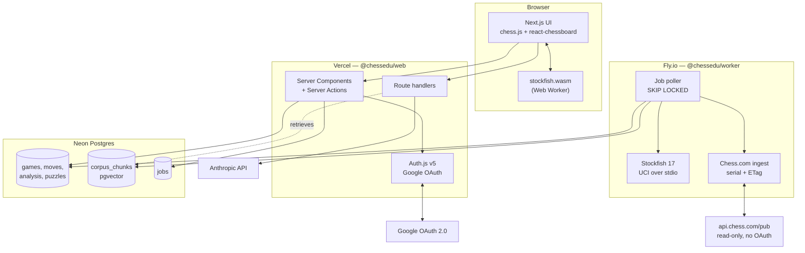
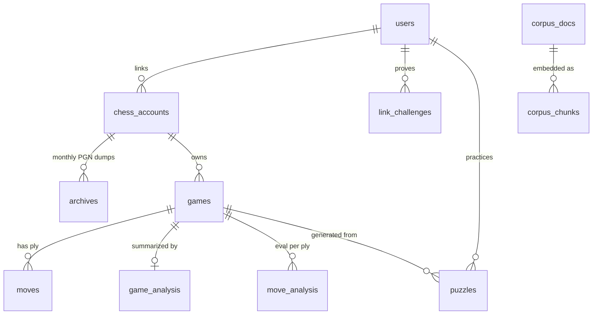
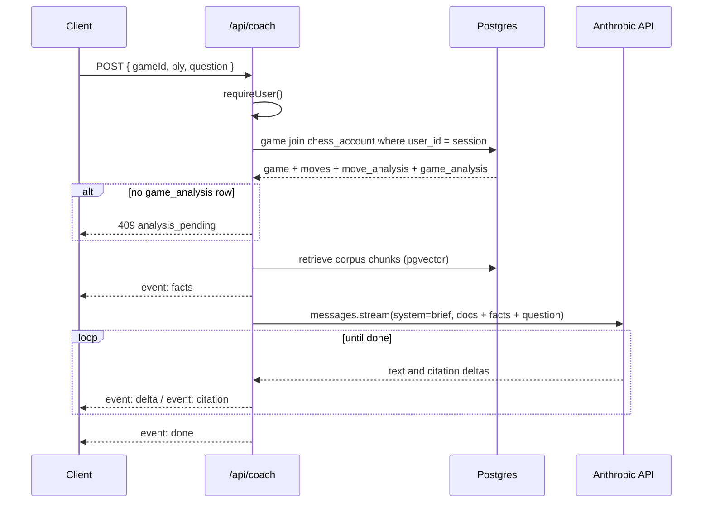
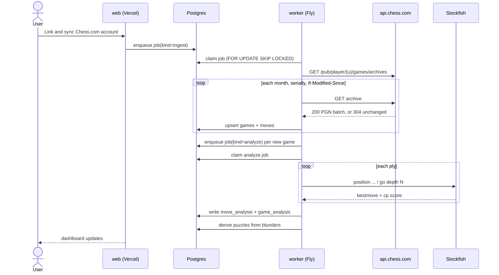

# ChessEdu — Architecture

> Source of truth for how the system is put together. Change this **before** changing code
> (see [CONTRIBUTING.md](../CONTRIBUTING.md)).

## 1. What this is

A personal chess trainer built on my own Chess.com history. Ingest the games, analyze them
with a real engine, and wrap the analysis in an education system: coaching, repertoire,
puzzles from my own blunders, reference literature, and bots to play.

Deployed as a **live website** with Google sign-in and a verified Chess.com account link.

## 2. Stack

| Layer | Choice | Why |
|---|---|---|
| Web app | Next.js 15 (App Router) + React 19 + TypeScript | One codebase for UI, server actions and API routes; first-class Vercel deploy |
| Styling | Tailwind CSS v4 | No config file, fast, consistent |
| Auth | Auth.js v5 (NextAuth), Google provider, DB sessions | Standard and audited; DB sessions give server-side revocation |
| Database | Postgres (Neon) + `pgvector` | Relational core *and* the RAG store in one datastore |
| ORM | Drizzle | Typed schema-as-code, real SQL escape hatch, good migrations |
| Job queue | Postgres `SELECT ... FOR UPDATE SKIP LOCKED` | Deep analysis is minutes long and cannot run in a serverless request. No Redis to operate |
| Analysis worker | Long-running Node service on Fly.io driving Stockfish over UCI | Needs a persistent process, CPU, and a real filesystem for NNUE weights |
| Browser engine | `stockfish.wasm` in a Web Worker | Instant hints and play without burning server CPU |
| Board UI | `chess.js` + `react-chessboard` | De-facto standard pair, well maintained |
| Coaching LLM | Anthropic API (`claude-opus-5`), server-side | It explains; it never evaluates — see sections 6 and 7 |
| Tests | Vitest, plus Playwright for one smoke E2E | Fast unit/integration loop, thin browser layer |
| CI/CD | GitHub Actions to Vercel (web) and Fly.io (worker) | See [ci-cd.md](./ci-cd.md) |

**Rejected:** a desktop app (the idea note left this open — the website wins because the game
history lives in the cloud anyway and there is nothing to install); Redis/BullMQ (a second
datastore to operate for a queue Postgres already handles at this scale); running Stockfish
inside serverless functions (execution time caps make full-history analysis impossible).

## 3. System shape



## 4. Repository layout

```
chessedu/
├── apps/
│   ├── web/          Next.js site: UI, auth, server actions, API routes
│   └── worker/       Long-running Node service: ingest + Stockfish analysis
├── packages/
│   ├── db/           Drizzle schema, migrations, client, job queue. The single schema owner.
│   ├── chess/        Pure domain logic: PGN parse, phase split, move classification,
│   │                 accuracy math, link-nonce rules. No I/O, so trivially testable.
│   └── chesscom/     The Chess.com API client. Shared, because the web app reads profiles to
│                     verify a link and the worker reads archives to ingest games.
├── docs/             Architecture, ADRs, runbooks.
└── .github/workflows CI + CD
```

`packages/chess` is deliberately **I/O-free**. Every rule that decides *what counts as a
blunder*, *when the endgame starts*, or *whether a link is verified* lives there behind a unit
test, not inside a React component or a worker loop.

## 5. Data model



The ownership chain is always `users -> chess_accounts -> games -> ...`. Every query the web
app makes is scoped by `userId` at the top of that chain; there is no row a user can reach
that is not reachable through their own `users.id`.

## 6. The coaching boundary

**The engine evaluates. The LLM explains.** This is a hard architectural rule carried over
from the idea note, and it is enforced structurally rather than by prompt discipline alone:

- Every number a coaching response cites — centipawn loss, best move, accuracy, phase
  strength — is read from `move_analysis` / `game_analysis`, computed by Stockfish, and passed
  to the model as *given facts* in the prompt.
- The model is never asked "was this a blunder?". It is asked "here is the blunder and the
  engine line; explain the idea the player missed."
- Reference-literature citations come from `corpus_chunks` retrieved via pgvector, so a claim
  about theory is attributable to a real source rather than recalled.

## 7. The coaching endpoint

`POST /api/coach` is the only path from the browser to the model. The coaching UI, puzzle review
and the repertoire view all consume it, so its shape is written down here **before** it is
implemented, and is treated as frozen: a change to the request, the event stream, or the fact
payload lands in this section first.

### 7.1 Why a route handler and not a server action

Every other write in this app is a server action (see `app/(app)/link/actions.ts`). Coaching is
not, for two reasons. The response is *streamed* — tokens are rendered as they arrive, and a
server action returns exactly once. And a single response carries three interleaved kinds of
payload: the engine facts, the prose, and the citations. Named SSE events keep them apart without
inventing a framing.

### 7.2 Request

```ts
// POST /api/coach   Content-Type: application/json
interface CoachRequest {
  /** A game the caller owns. Ownership is re-derived server-side; see 7.6. */
  gameId: string;
  /** Focus one move. Omitted, the whole game is in scope. */
  ply?: number;
  /** What the user asked. Omitted, the coach explains the moves in scope unprompted. */
  question?: string;
  /** Prior turns of this coaching thread, carried by the client. Untrusted — see below. */
  history?: CoachTurn[];
}

interface CoachTurn {
  role: 'user' | 'assistant';
  text: string;
}
```

| Field | Rule | On violation |
|---|---|---|
| `gameId` | UUID, and reachable from the session user through `chess_accounts` | `403` / `404`, per 7.6 |
| `ply` | integer in `1..game.moveCount` | `422` |
| `question` | at most `COACH_MAX_QUESTION_CHARS` (500) | `422` |
| `history` | at most `COACH_MAX_HISTORY_TURNS` (8), 4000 chars total, alternating from `user` | oldest turns dropped, then `422` |

**There is no `userId` field, and there never will be one.** The handler calls `requireUser()` and
scopes every query by the result, exactly like the server actions do.

`history` is echoed back to the model as conversation, but it is **not** a source of facts. Every
number in the next answer is re-read from `move_analysis` / `game_analysis` on this request. A
client that edits an assistant turn to claim a different evaluation changes the prose it is
replying to and nothing else. Persisting threads server-side is deferred — see section 10.

### 7.3 Response — an SSE stream

`200` with `Content-Type: text/event-stream`, `Cache-Control: no-store`, and
`X-Accel-Buffering: no` so nothing in front of the app buffers the stream into one lump.

| Event | Payload | When |
|---|---|---|
| `facts` | `CoachFacts` | Exactly once, **before any prose**. |
| `delta` | `{ text: string }` | Repeatedly, as the model streams. |
| `citation` | `CoachCitation` | As each citation arrives, interleaved with `delta`. |
| `done` | `{ stopReason, usage: { inputTokens, outputTokens, cacheReadTokens } }` | Exactly once, last. |
| `error` | `{ code, message }` | Terminal, and only *after* the stream has opened. |

`facts` arriving first is a contract, not an accident: it lets the UI paint the eval bar and the
engine line before the first token, and it lets a test assert that the numbers the prose cites
were handed to the model rather than recalled by it.

Once the response has started there is no status code left to send, so a mid-stream failure is an
`error` event followed by the connection closing. A client must handle a stream that ends after
`facts` with no `done`.



### 7.4 The facts payload

```ts
interface CoachFacts {
  game: {
    id: string;
    url: string;
    playedAt: string; // ISO 8601
    userColor: 'w' | 'b';
    userResult: 'win' | 'loss' | 'draw';
    timeControl: string;
    eco: string | null;
    userRating: number | null;
    opponentRating: number | null;
  };
  analysis: {
    engine: string; // e.g. "Stockfish 17"
    depth: number;
    accuracy: number | null; // the user's side
    acpl: number | null; // the user's side
    blunderCount: number;
    mistakeCount: number;
    inaccuracyCount: number;
  };
  /** Only the plies in scope, ascending. */
  moves: CoachMoveFact[];
}

interface CoachMoveFact {
  ply: number;
  color: 'w' | 'b';
  san: string;
  uci: string;
  fenBefore: string;
  phase: 'opening' | 'middlegame' | 'endgame';
  evalCp: number | null; // after the move, White's perspective
  mateIn: number | null;
  bestMoveUci: string | null;
  pv: string[];
  centipawnLoss: number;
  winPercentLoss: number;
  classification: 'blunder' | 'mistake' | 'inaccuracy' | 'good';
  isCritical: boolean;
  clockMs: number | null;
}
```

Every field is a column of `moves` / `move_analysis` / `game_analysis`, passed through unmodified.
Nothing here is computed at request time, and nothing here is produced by the model.

**Which plies are in scope:**

| Request | Scope |
|---|---|
| `ply` given | that ply, plus `COACH_CONTEXT_PLIES` (2) either side, clamped to the game |
| `ply` omitted | every `isCritical` move, then the highest `winPercentLoss` moves until `COACH_MAX_MOVES` (12) is reached, ascending by ply |

The whole-game cap exists so that a 200-ply game does not become a 200-move prompt. A user who
wants a move the cap excluded asks for it by `ply`.

### 7.5 Citations

Retrieved corpus chunks are passed as `document` content blocks with `citations: { enabled: true }`,
which makes the API return the exact span it used:

```ts
interface CoachCitation {
  /** Index into the documents sent this turn, and the order they appear in the prose. */
  index: number;
  chunkId: string; // corpus_chunks.id
  docTitle: string;
  author: string | null;
  locator: string | null; // e.g. "ch. 4, p. 91"
  quotedText: string; // the span the model actually cited
}
```

The server maps the API's `document_index` back to the `corpus_chunks` row it sent, so a citation
always resolves to a real row. **The coach cannot cite a source it was not handed** — the retrieval
half of the rule in section 6, enforced by construction rather than by asking nicely.

At most `COACH_MAX_CHUNKS` (6) chunks are retrieved. The corpus is allowed to be empty: the
endpoint answers normally and emits zero `citation` events, so nothing here blocks on the corpus
ingest existing.

### 7.6 Failures before the stream opens

Ordinary HTTP responses, with a JSON body `{ code, message }`.

| Status | `code` | Cause |
|---|---|---|
| `401` | `unauthenticated` | No session. |
| `403` | `forbidden` | The game exists and belongs to someone else. |
| `404` | `game_not_found` | No such game. |
| `409` | `analysis_pending` | The game has no `game_analysis` row yet. Body carries `{ jobState }`. |
| `422` | `invalid_request` | A rule in 7.2 was broken. The body names the field. |
| `429` | `rate_limited` | Over the per-user limit. Carries `Retry-After`. |
| `503` | `coach_unavailable` | The upstream API failed before the first token. |

`403` versus `404` is deliberate. Game ids are unguessable UUIDs, so distinguishing "not yours"
from "not there" leaks nothing and makes a support question answerable.

**`409` is the coaching boundary expressed as a status code.** With no engine analysis there are no
facts, and a coach with no facts would have to improvise the evaluation — precisely what section 6
forbids. So the endpoint refuses, and the UI's job is to say the analysis is still running rather
than to ask the model anyway.

### 7.7 Prompt assembly and caching

The request is rendered in the order the API caches in — `system`, then `messages`:

1. **`system`** — one text block: the frozen coaching brief. Role, the "engine evaluates, model
   explains" rule, how to cite, and the output style. Marked `cache_control: { type: 'ephemeral' }`.
2. **`messages`** — the retrieved chunks as `document` blocks, then `CoachFacts` as JSON, then the
   history, then the question.

| Parameter | Value | Why |
|---|---|---|
| `model` | `claude-opus-5` | |
| `max_tokens` | `4096` | A coaching answer is paragraphs, not a document. |
| transport | `client.messages.stream(...)` | The UI renders tokens as they arrive. |
| `thinking` | `{ type: 'adaptive' }` | Reasoning is never surfaced, so `display` stays at its `omitted` default. |
| `output_config.effort` | default (`high`) | The cost lever. Lower it against measured answer quality, not on a hunch. |
| `output_config.format` | **unset** | Structured outputs and document citations are mutually exclusive, and the response is prose. |

Two things the brief must respect to actually cache. It has to be **byte-stable** — no player name,
no date, no game id, nothing per-request; all of that belongs in `messages`. And it has to clear the
minimum cacheable prefix (512–4096 tokens depending on the model), below which caching silently does
nothing. The test asserts `usage.cache_read_input_tokens > 0` on the second of two identical-prefix
requests, because a silent cache miss is otherwise invisible until the bill arrives.

### 7.8 What this endpoint needs that does not exist yet

- **Retrieval** over `corpus_chunks`. Until it lands the endpoint runs with zero chunks and emits no
  citations; the contract does not change when it arrives.
- **The rate-limit mechanism.** The surface is fixed (`429` + `Retry-After`); where the counter lives
  is open — see section 10.

## 8. Analysis pipeline



Ingest is **serial and conditional**: Chess.com rate-limits parallel requests and supports
`If-Modified-Since`, so re-syncing an unchanged month costs a single 304. See
[chess-com-linking.md](./chess-com-linking.md).

## 9. Security posture

- **Sessions** are database-backed, in `httpOnly` + `Secure` + `SameSite=Lax` cookies. No JWT
  in local storage; a session can be revoked server-side.
- **Google OAuth is the only credential path.** No passwords are stored, ever.
- **Authorization is enforced in server code**, never by hiding UI. Every server action
  re-derives `userId` from the session and scopes its query by it.
- **The Chess.com link proves ownership** before any data is attributed to a user. A username
  alone is a public string and proves nothing — see the nonce flow in
  [chess-com-linking.md](./chess-com-linking.md).
- **Secrets** live in Vercel/Fly environment config and `.env.local`. `.env` is gitignored and
  `.env.example` carries only names. The Anthropic key is server-only and never reaches the
  browser.
- **The worker exposes no inbound port.** It polls Postgres; nothing can call it.

## 10. Open questions

Carried from the idea note:

- Lichess as a second ingest source. The `platform` column exists for it; nothing else does.
- Reference-literature licensing. Bootstrap on public-domain classics only.
- Maia/Lc0 bot hosting is heavier than Stockfish — likely a separate Fly machine running a
  CPU Lc0 build with small nets. Not scaffolded yet.

Raised by the coaching endpoint (section 7):

- **Coaching threads are not persisted.** The client carries `history`, which is enough to hold a
  conversation and cheap to throw away, but it loses the thread on reload and cannot be mined for
  what a user keeps asking about. The successor is a `coach_threads` / `coach_messages` pair in
  `packages/db`; the request contract then gains a `threadId` and loses nothing else.
- **Where the rate-limit counter lives.** Vercel functions are stateless and there is no Redis, by
  choice (ADR 0001), so the candidates are a Postgres table or the platform's own limiter. Until
  one is picked, `429` is specified but never returned.
