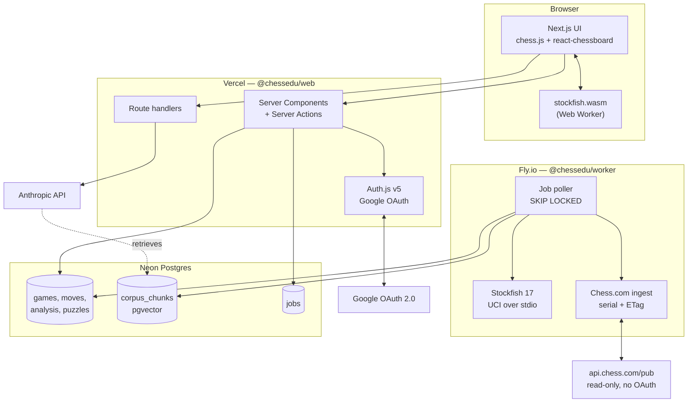
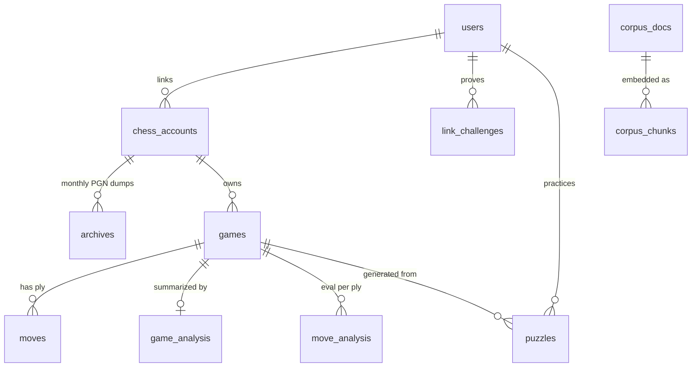
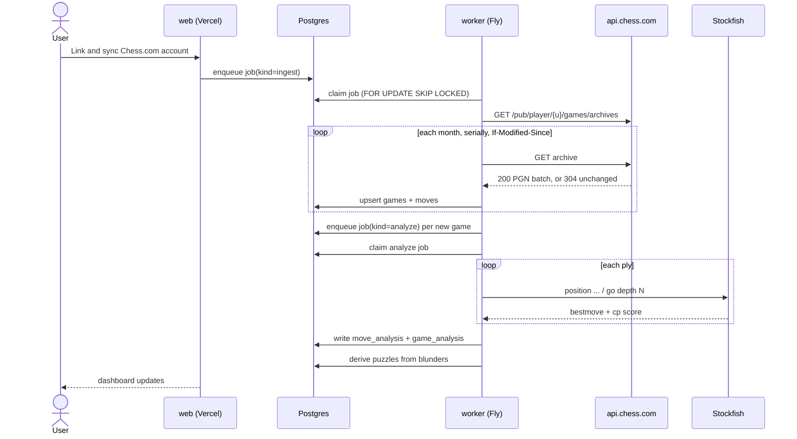
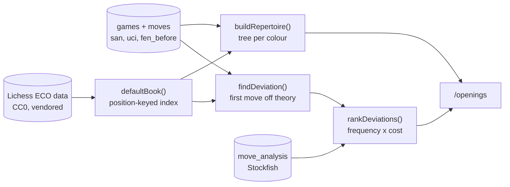

# ChessEdu — Architecture

> Source of truth for how the system is put together. Change this **before** changing code
> (see [CONTRIBUTING.md](../CONTRIBUTING.md)).

## 1. What this is

A personal chess trainer built on my own Chess.com history. Ingest the games, analyze them
with a real engine, and wrap the analysis in an education system: coaching, repertoire,
puzzles from my own blunders, reference literature, and bots to play.

Deployed as a **live website** with Google sign-in and a verified Chess.com account link.

## 2. Stack

| Layer | Choice | Why |
|---|---|---|
| Web app | Next.js 15 (App Router) + React 19 + TypeScript | One codebase for UI, server actions and API routes; first-class Vercel deploy |
| Styling | Tailwind CSS v4 | No config file, fast, consistent |
| Auth | Auth.js v5 (NextAuth), Google provider, DB sessions | Standard and audited; DB sessions give server-side revocation |
| Database | Postgres (Neon) + `pgvector` | Relational core *and* the RAG store in one datastore |
| ORM | Drizzle | Typed schema-as-code, real SQL escape hatch, good migrations |
| Job queue | Postgres `SELECT ... FOR UPDATE SKIP LOCKED` | Deep analysis is minutes long and cannot run in a serverless request. No Redis to operate |
| Analysis worker | Long-running Node service on Fly.io driving Stockfish over UCI | Needs a persistent process, CPU, and a real filesystem for NNUE weights |
| Browser engine | `stockfish.wasm` in a Web Worker | Instant hints and play without burning server CPU |
| Board UI | `chess.js` + `react-chessboard` | De-facto standard pair, well maintained |
| Coaching LLM | Anthropic API (`claude-opus-5`), server-side | It explains; it never evaluates — see section 6 |
| Tests | Vitest, plus Playwright for one smoke E2E | Fast unit/integration loop, thin browser layer |
| CI/CD | GitHub Actions to Vercel (web) and Fly.io (worker) | See [ci-cd.md](./ci-cd.md) |

**Rejected:** a desktop app (the idea note left this open — the website wins because the game
history lives in the cloud anyway and there is nothing to install); Redis/BullMQ (a second
datastore to operate for a queue Postgres already handles at this scale); running Stockfish
inside serverless functions (execution time caps make full-history analysis impossible).

## 3. System shape



## 4. Repository layout

```
chessedu/
├── apps/
│   ├── web/          Next.js site: UI, auth, server actions, API routes
│   └── worker/       Long-running Node service: ingest + Stockfish analysis
├── packages/
│   ├── db/           Drizzle schema, migrations, client, job queue. The single schema owner.
│   ├── chess/        Pure domain logic: PGN parse, phase split, move classification,
│   │                 accuracy math, opening book + repertoire + deviation detection,
│   │                 link-nonce rules. No I/O, so trivially testable.
│   └── chesscom/     The Chess.com API client. Shared, because the web app reads profiles to
│                     verify a link and the worker reads archives to ingest games.
├── docs/             Architecture, ADRs, runbooks.
└── .github/workflows CI + CD
```

`packages/chess` is deliberately **I/O-free**. Every rule that decides *what counts as a
blunder*, *when the endgame starts*, or *whether a link is verified* lives there behind a unit
test, not inside a React component or a worker loop.

## 5. Data model



The ownership chain is always `users -> chess_accounts -> games -> ...`. Every query the web
app makes is scoped by `userId` at the top of that chain; there is no row a user can reach
that is not reachable through their own `users.id`.

## 6. The coaching boundary

**The engine evaluates. The LLM explains.** This is a hard architectural rule carried over
from the idea note, and it is enforced structurally rather than by prompt discipline alone:

- Every number a coaching response cites — centipawn loss, best move, accuracy, phase
  strength — is read from `move_analysis` / `game_analysis`, computed by Stockfish, and passed
  to the model as *given facts* in the prompt.
- The model is never asked "was this a blunder?". It is asked "here is the blunder and the
  engine line; explain the idea the player missed."
- Reference-literature citations come from `corpus_chunks` retrieved via pgvector, so a claim
  about theory is attributable to a real source rather than recalled.

## 7. Analysis pipeline



Ingest is **serial and conditional**: Chess.com rate-limits parallel requests and supports
`If-Modified-Since`, so re-syncing an unchanged month costs a single 304. See
[chess-com-linking.md](./chess-com-linking.md).

## 8. Opening repertoire

The repertoire is not a generic opening book. It is **the lines the player actually plays**,
assembled from their own games, with mainline theory laid over the top so the point where they
leave it is visible.



**The tree.** One root per colour, since a repertoire is colour-specific. Each node is a
position reached by a move the player made or faced, carrying how many of their games ran
through it and how those games scored *from their perspective*. Lines are followed to
`OPENING_MAX_PLY`, the same ply cap the phase model uses, so "opening" means one thing across
the app.

**The book.** ECO lines from the Lichess data set, expanded with `chess.js` into an index
keyed by position rather than move order — so a transposition into a named line is recognised
as that line. See [ADR 0003](./adr/0003-opening-theory-source.md) for why this source and not
another. The book answers three questions and no others: *is this position theory*, *what is
it called*, and *what does theory play from here*.

**Deviation detection.** Walk a game's plies while each move is one of the book's known
continuations. The first move that is not is the deviation, and it comes in two kinds:

| Kind | Meaning | Taught? |
|---|---|---|
| `novelty` | The position had known continuations; the player chose something else | Yes — this is the lesson |
| `out-of-book` | Theory simply ends here; there was nothing to leave | No |

Deviations are then grouped by position across the whole history and ranked by
`games x average centipawn loss`, so the habit that costs the most surfaces first — a small
error repeated forty times outranks a disaster played once.

**The punishment comes from the engine.** Nothing in `packages/chess` decides that a deviation
was bad. `rankDeviations()` is handed the `move_analysis` row for the deviating ply and reports
what Stockfish already concluded. The book is a source of names and alternatives; it is not a
second evaluator. This is the coaching boundary of section 6 applied to opening theory.

All of it lives in `packages/chess` (`book.ts`, `repertoire.ts`, `deviation.ts`) behind unit
tests. `apps/web/lib/openings.ts` does the reading; the page at `/openings` only renders.

## 9. Security posture

- **Sessions** are database-backed, in `httpOnly` + `Secure` + `SameSite=Lax` cookies. No JWT
  in local storage; a session can be revoked server-side.
- **Google OAuth is the only credential path.** No passwords are stored, ever.
- **Authorization is enforced in server code**, never by hiding UI. Every server action
  re-derives `userId` from the session and scopes its query by it.
- **The Chess.com link proves ownership** before any data is attributed to a user. A username
  alone is a public string and proves nothing — see the nonce flow in
  [chess-com-linking.md](./chess-com-linking.md).
- **Secrets** live in Vercel/Fly environment config and `.env.local`. `.env` is gitignored and
  `.env.example` carries only names. The Anthropic key is server-only and never reaches the
  browser.
- **The worker exposes no inbound port.** It polls Postgres; nothing can call it.

## 10. Open questions carried from the idea note

- Lichess as a second ingest source. The `platform` column exists for it; nothing else does.
- Reference-literature licensing. Bootstrap on public-domain classics only. **Partly settled:**
  the *structural* opening theory source is decided — CC0 ECO data, see
  [ADR 0003](./adr/0003-opening-theory-source.md). What is still open is prose literature for
  `corpus_docs`, where anything past public domain needs its own licence decision per document.
- Move-frequency and result data for theory, so the book can say which of two theory moves is
  actually played. The Lichess opening explorer is the obvious source and the reason ADR 0003
  would be revisited; it needs a Postgres cache first, because `packages/chess` stays I/O-free.
- Maia/Lc0 bot hosting is heavier than Stockfish — likely a separate Fly machine running a
  CPU Lc0 build with small nets. Not scaffolded yet.
