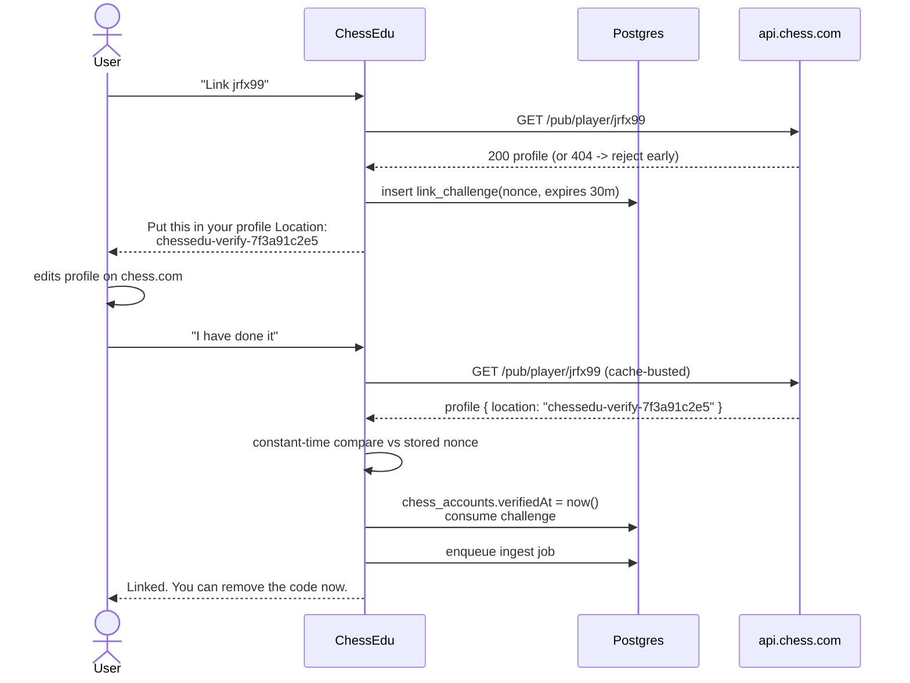
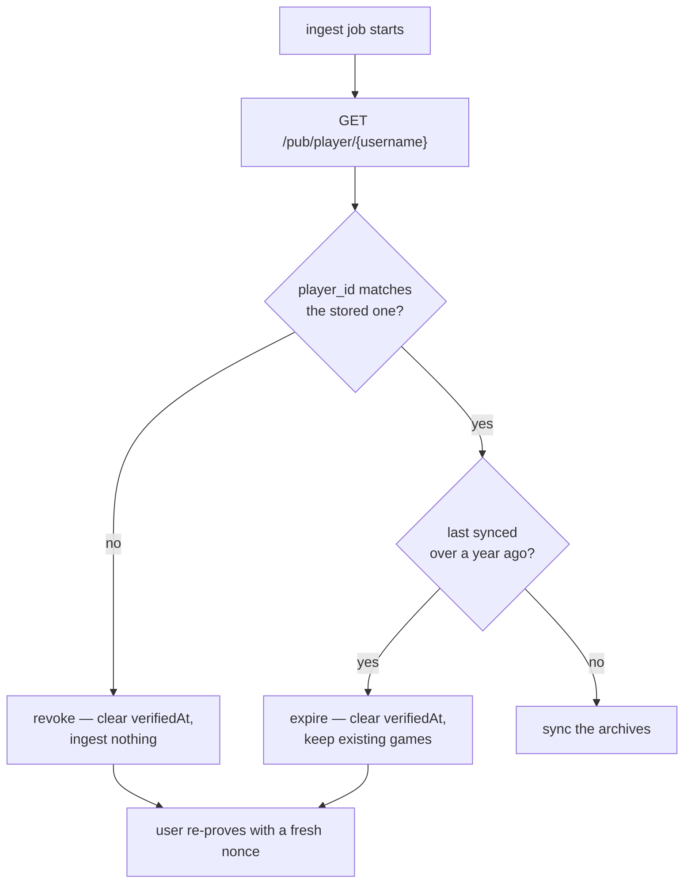

# Linking a Chess.com account

## The constraint

**Chess.com has no public OAuth.** The Published-Data API at `https://api.chess.com/pub/...`
is unauthenticated and read-only — anyone can fetch anyone's public games. There is a partner
programme with real OAuth, but it is gated and not available for a personal project.

Two consequences shape the whole design:

1. **We cannot ask Chess.com to authenticate the user for us.** Typing a username proves
   nothing — anyone could type `hikaru` and claim his history.
2. **We do not need write access.** Read-only public data is exactly what the analytics want,
   so the missing OAuth costs us nothing except the ownership proof.

So we build the ownership proof ourselves.

## The proof: a nonce in the public profile

The user puts a one-time code somewhere on their Chess.com profile that only the account owner
can edit. We read it back through the public API. If it matches, they own the account.

**Which field.** `location` is the default: it is free text, shown on the public profile, and
returned by `/pub/player/{username}` as `location`. `name` works as a fallback for users who
would rather not touch their location. Both are checked; a match in either passes.

**Nonce rules** (implemented in `packages/chess/src/link.ts`, tested in `link.test.ts`):

- 16 hex chars from `crypto.randomBytes(8)` — not `Math.random`.
- Prefixed `chessedu-verify-` so it is obvious to the user and to us what it is.
- Expires after 30 minutes; single-use, consumed on success.
- Compared with `crypto.timingSafeEqual` after normalisation (trim, lowercase). The profile
  field is matched by **substring** so the user can keep their real location alongside it.
- Rate limited to 10 verification attempts per challenge, to stop a poll loop hammering the API.

**After verification** the user is told they can delete the code. Verification is a one-time
event; `verifiedAt` is stored, and the nonce is not re-checked on later syncs.

## Re-verification

A proof of ownership goes stale. Two things invalidate it, and the worker checks both at the top
of every sync, before it fetches a single archive.

**The account behind the username changed.** Chess.com usernames can be released and reclaimed,
so `jrfx99` today need not be `jrfx99` next year. `player_id` is the stable identity; the
username is not. If the `player_id` at that username no longer matches the one recorded when the
link was proved, the link points at a different account: it is revoked at once, `verifiedAt` is
cleared, and nothing is ingested.

This is the case that matters. Ingesting under a stale link would attribute a stranger's games
to the user, and every number downstream would quietly be about someone else.

**The proof is simply old.** A link last synced over a year ago is re-proved as hygiene, whether
or not anything looks wrong. This one is not urgent — the games already stored are still the
user's, so they are kept and only further ingest pauses.

The rules are pure functions in `packages/chess/src/link.ts` (`reverificationNeeded`), tested in
`link.test.ts`. The worker applies them at the top of `apps/worker/src/handlers/ingest.ts`, and
the accounts page shows a link that needs re-proving.

**A link with no stored `platformUserId`** predates this check. It is not treated as a mismatch —
there is nothing to compare against — and the id is recorded on the next successful sync so the
check works from then on.

## Ingest, and being a good API citizen

The endpoints we use, in order:

| Endpoint | Purpose |
|---|---|
| `/pub/player/{username}` | Profile, `player_id`, and the verification field |
| `/pub/player/{username}/games/archives` | List of monthly archive URLs |
| `/pub/player/{username}/games/{YYYY}/{MM}` | One month of games as JSON with embedded PGN |

Rules the client follows (`packages/chesscom/src/client.ts`, tested in `client.test.ts`):

- **Serial, never parallel.** Chess.com tolerates sequential requests but returns `429` for
  parallel ones from the same IP. The worker fetches one archive at a time.
- **Conditional requests.** Archives are cached with their `ETag` / `Last-Modified`; a re-sync
  sends `If-None-Match` and treats `304` as "nothing new this month". Only the current month
  normally changes.
- **A descriptive `User-Agent`** with a contact address. Chess.com blocks generic and empty
  agents.
- **Backoff on 429**, respecting `Retry-After`, with exponential fallback.
- **Only the current and future months are re-fetched** once a past month has been seen with a
  stable ETag — historical months are immutable in practice.

## Why not scrape, and why not ask for a password

Both were considered and rejected. Scraping breaks the terms of service and the markup;
asking for Chess.com credentials would be phishing our own user for a third-party password
we have no right to hold. The nonce flow gets a real ownership proof with neither problem.
