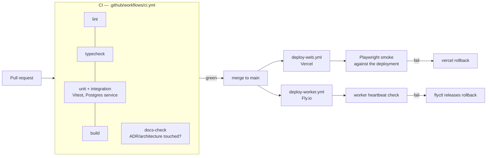

# CI/CD

## Principle

Nothing reaches `main` that has not typechecked, linted, passed its tests, and built.
Nothing deploys that has not passed CI. Every deploy is traceable to a commit.

## Workflows

| File                | Trigger                                              | Does                                                                                            |
| ------------------- | ---------------------------------------------------- | ----------------------------------------------------------------------------------------------- |
| `ci.yml`            | PR + push to `main`                                  | lint, typecheck, migrate against a throwaway Postgres, `vitest run --coverage`, build both apps |
| `deploy-web.yml`    | push to `main` (paths: `apps/web`, `packages/**`)    | Vercel production deploy, then a Playwright smoke test against the live URL                     |
| `deploy-worker.yml` | push to `main` (paths: `apps/worker`, `packages/**`) | `flyctl deploy` with a release command that runs migrations, then a heartbeat check             |
| `preview.yml`       | PR                                                   | Vercel preview deploy, comments the URL on the PR                                               |

CI runs Postgres 17 with `pgvector` as a service container, so migrations and the queue's
`SKIP LOCKED` behaviour are exercised against real Postgres rather than a mock.

Every build of the web app — in CI, in `vercel build`, and locally — first runs
`scripts/fetch-stockfish.mjs` from its `prebuild` script, which downloads the browser
Stockfish from unpkg and verifies it against a pinned SHA-256. That makes the build depend on
one more host being up, and makes a checksum mismatch a build failure rather than a broken
page. Both are deliberate; see [browser-engine.md](./browser-engine.md).

## Required repository secrets

| Secret                                                         | Used by                 |
| -------------------------------------------------------------- | ----------------------- |
| `VERCEL_TOKEN`, `VERCEL_ORG_ID`, `VERCEL_PROJECT_ID`           | `deploy-web`, `preview` |
| `FLY_API_TOKEN`                                                | `deploy-worker`         |
| `DATABASE_URL` (production, for the migration release command) | `deploy-worker`         |

Runtime secrets — `AUTH_SECRET`, `AUTH_GOOGLE_ID`, `AUTH_GOOGLE_SECRET`, `ANTHROPIC_API_KEY`,
`DATABASE_URL` — live in the Vercel and Fly environment configs, not in GitHub. See
`.env.example` for the full list.

## Migrations

Migrations are generated by Drizzle, committed as SQL, and applied by the **worker's** Fly
release command — one place, one time, before new code starts. The web app never migrates on
boot. Migrations must be backward compatible with the currently deployed code so that the two
services can be mid-rollout at the same time: add columns before writing them, stop reading a
column before dropping it.

## Environments

| Environment      | Web            | Worker                    | Database                                       |
| ---------------- | -------------- | ------------------------- | ---------------------------------------------- |
| local            | `npm run dev`  | `npm run dev:worker`      | local Postgres in Docker, or a Neon dev branch |
| preview (per PR) | Vercel preview | not deployed              | Neon branch, seeded                            |
| production       | Vercel prod    | Fly app `chessedu-worker` | Neon primary                                   |
